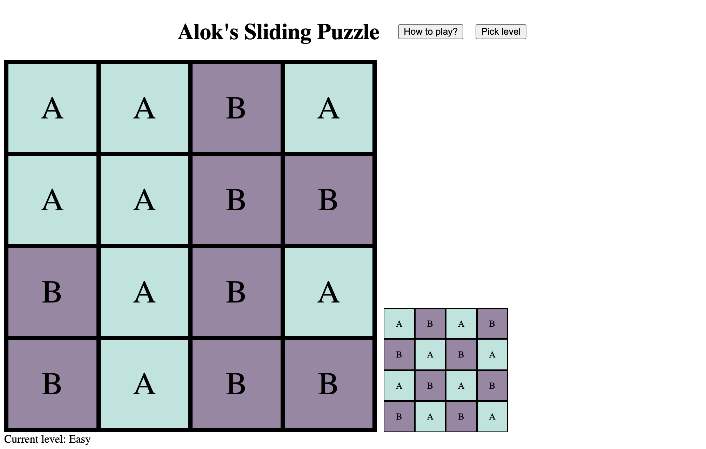

# Alok's Sliding Puzzle
A sliding puzzle with a Rubik's cube-like feel.

Play: [https://www.quaxio.com/sliding_puzzle/puzzle.html](https://www.quaxio.com/sliding_puzzle/puzzle.html)

Screenshot:

## Building locally

1. Clone this repo: `git clone https://github.com/alokmenghrajani/sliding_puzzle.git`
2. `cd sliding_puzzle`
3. Install packages: `yarn install`
4. Build: `npx webpack --env env=prod`
5. Tada: `open dist/puzzle.html`
